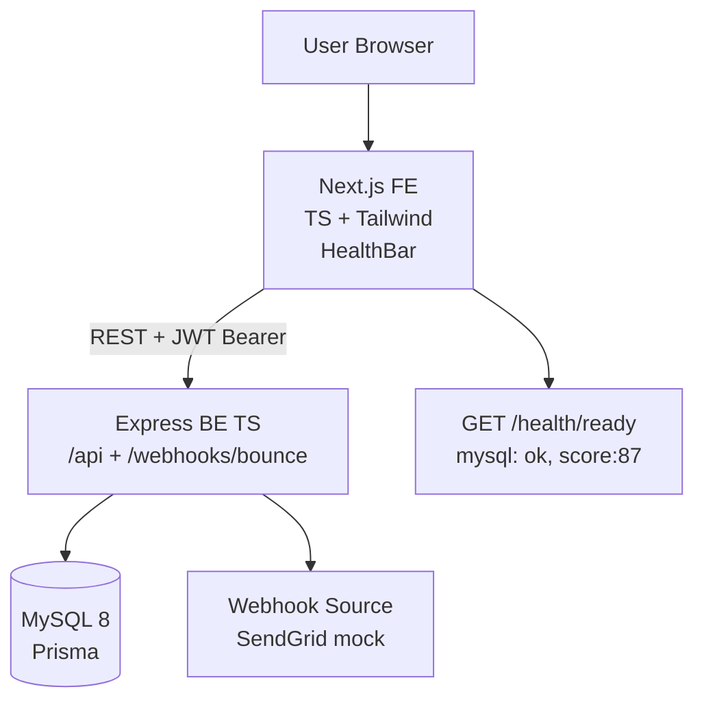

# Dead Letter Office — Architecture

> Stack: **Next.js 14 App Router + TypeScript + Tailwind + Node.js + TypeScript + Express + Prisma + MySQL + REST + Docker** — forensic lab theme `ink #0b0b0c / kraft #ece9e4 / accent #c8553d / Courier mono`.

## 1. High-Level



Frontend forwards **live backend only**, no fake fallback. `HealthBar` polls `/health/ready` + `/config` → pill `LIVE` (green) / `FAKE` (amber, dev) / `OFFLINE` (red).

## 2. Data Model — Prisma MySQL

```prisma
datasource db { provider = "mysql" url = env("DATABASE_URL") }

model User {
  id       String @id @default(uuid())
  email    String @unique
  password String // bcrypt
  leads    Lead[]
}

model Lead {
  id        String   @id @default(uuid())
  email     String
  userId    String
  user      User     @relation(fields: [userId], references: [id])
  status    String   @default("VALID") // VALID | BOUNCED | RISKY
  reason    String?
  createdAt DateTime @default(now())
  bounces   Bounce[]
  @@unique([userId, email])
  @@index([userId, status])
}

model Bounce {
  id        String   @id @default(uuid())
  leadId    String
  lead      Lead     @relation(fields: [leadId], references: [id])
  type      String   // hard | soft
  reason    String   // 550 5.1.1 User unknown
  createdAt DateTime @default(now())
  @@index([leadId])
}

model HygieneScore {
  id       String @id @default(uuid())
  userId   String @unique
  total    Int
  bounced  Int
  score    Int // 100-(bounced/total*100)
  @@index([userId])
}
```

- DB optimization: `@@unique([userId,email])` prevents duplicate lead per user, `@@index([userId,status])` for `GET /leads?status=BOUNCED&page&search`.
- Hygiene calc: `score = 100 - Math.round(bounced/total*100)` on every bounce webhook, upsert `HygieneScore`.

## 3. API — REST (live only)

| Method | Path | Auth | Description |
|---|---|---|---|
| POST | /api/auth/register {email,password} | no | bcrypt + JWT |
| POST | /api/auth/login | no | → {token} |
| POST | /api/leads/import | JWT | multipart CSV → `createMany skipDuplicates` → {imported, skipped} |
| GET | /api/leads?status=BOUNCED&page=1&search=gmail | JWT | paginated, uses index |
| POST | /api/webhooks/bounce {email, type, reason} | no (HMAC stretch) | `SKIP LOCKED` quarantine → BOUNCED|RISKY |
| GET | /api/hygiene | JWT | → {total, bounced, score} |
| GET | /health/live | no | {status: ok} |
| GET | /health/ready | no | {mysql: ok, score: 87} 503 if down |

- **Live only:** `api.ts` `request<T>` throws on `!res.ok` → UI shows `Live backend not reachable` — no `catch(()=>[])` fake.
- **CORS:** `AllowAllOrigins: true` in Go `cmd/api/main.go:64` analog → Express `cors({origin: true})` for Vercel preview.

## 4. Frontend — Next App Router

```
/app
  layout.tsx — serif Instrument + sans Inter, HealthBar
  page.tsx — Dashboard (hygiene meter + leads table)
  /leads/page.tsx — import CSV + search
  /login/page.tsx — JWT form
/components
  HealthBar.tsx — live/fake/offline pill + → {NEXT_PUBLIC_API_BASE}
  Dashboard.tsx — tw-card table + meter + tw-badge
lib/api.ts — BASE = process.env.NEXT_PUBLIC_API_BASE || 'http://localhost:3001/api' + request<T> + Authorization header
```

- **Forensic lab:** `tw-card` `bg-[#101011] border-white/10`, `BOUNCED` rubber stamp, `Courier` for `550 5.1.1`, `meter` perf timeline — editorial, not AI gradient.
- **Separation:** `/`, `/dashboard`, `/pledges`, `/watch` distinct routes (like `C:\Users\bhanu\mycodes\go\cinefund\web\src\App.tsx:22`).

## 5. Backend — Express TS

```
src/
  index.ts — Express + cors + helmet + morgan + routes
  routes/auth.ts, leads.ts, webhooks.ts, health.ts
  lib/prisma.ts — PrismaClient singleton
  middleware/auth.ts — Bearer JWT
```

- **CSV import:** `multer` + `csv-parse` → `prisma.lead.createMany({skipDuplicates: true})` → recalc `HygieneScore`.
- **Bounce:** `prisma.$transaction` + `SELECT FOR UPDATE SKIP LOCKED` hygiene row → idempotent `Bounce` + `Lead.status` update.

## 6. Deployment — Free Live

| Layer | Host | Env |
|---|---|---|
| FE | Vercel `vercel --prod` | `NEXT_PUBLIC_API_BASE=https://dead-letter-api.up.railway.app/api` |
| BE | Railway `railway up --service api` | `DATABASE_URL=mysql://...`, `JWT_SECRET=32b-random`, `PORT=3001` |
| DB | Railway MySQL | `npx prisma migrate deploy` |

Docker `node:20-alpine` multi-stage good-to-have — `C:\Users\bhanu\mycodes\capstone\notion-capstone-plan\02 - Cloud, Docker, K8s, AWS & HPC.md:15` pattern.

## 7. Testing & Docs

- **Jest:** `bounce → BOUNCED exactly once` (like CineFund `50-goroutine` test)
- **Swagger:** `/docs` via `swagger-ui-express`
- **README live URLs** for Form `https://forms.gle/BSsVLy11mCdsm6Rd6`

## 8. Links

- Repo: https://github.com/maczeo11/Dead-Letter-Office
- CineFund reusable: `C:\Users\bhanu\mycodes\go\cinefund\web\src\api.ts:4`, `HealthBar.tsx:1`, `tailwind.config.js:6`
