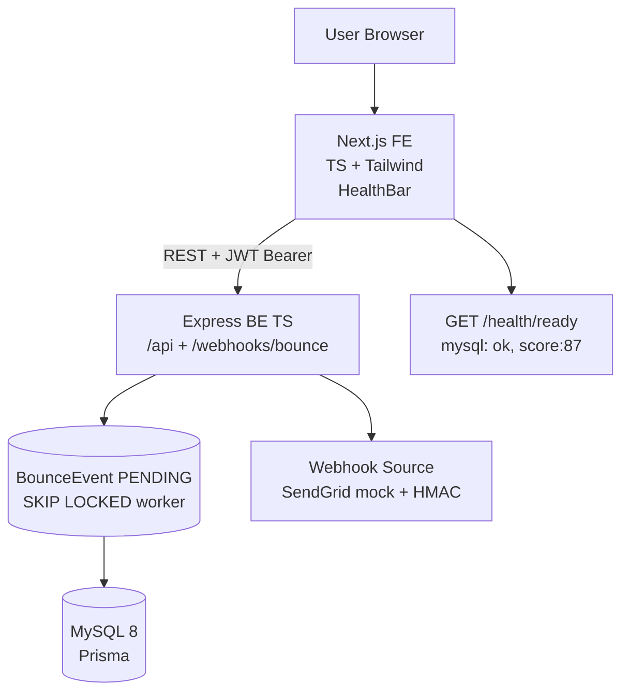

# Dead Letter Office — Architecture

> Stack: **Next.js 14 App Router + TypeScript + Tailwind + Node.js + TypeScript + Express + Prisma + MySQL + REST + Docker** — forensic lab theme `ink #0b0b0c / kraft #ece9e4 / accent #c8553d / Courier mono`.

## 1. High-Level



Frontend forwards **live backend only**, no fake fallback. `HealthBar` polls `/health/ready` → pill `LIVE` (green) / `OFFLINE` (red). Bounce path is queued — `SKIP LOCKED` belongs to worker, not webhook.

## 2. Data Model — Prisma MySQL (paste-ready, fixes baked in)

```prisma
generator client {
  provider      = "prisma-client-js"
  binaryTargets = ["native", "linux-musl-openssl-3.0.x"] // required for alpine Docker
}

datasource db { provider = "mysql" url = env("DATABASE_URL") }

model User {
  id String @id @default(uuid())
  email String @unique
  password String
  createdAt DateTime @default(now())
  leads Lead[]
  score HygieneScore?
}

model Lead {
  id String @id @default(uuid())
  email String
  userId String
  status String @default("VALID") // VALID | BOUNCED | RISKY
  softCount Int @default(0)
  reason String? @db.Text // raw SMTP 550 line — exceeds VARCHAR(191)
  createdAt DateTime @default(now())
  user User @relation(fields: [userId], references: [id])
  bounces Bounce[]
  @@unique([userId, email]) // prefix search uses this — never leading %
  @@index([userId, status])
}

model Bounce {
  id String @id @default(uuid())
  leadId String
  eventId String @unique // webhook idempotency — retries can't corrupt score
  type String // hard | soft
  reason String? @db.Text
  createdAt DateTime @default(now())
  lead Lead @relation(fields: [leadId], references: [id])
  @@index([leadId])
}

model BounceEvent { // the queue — this is what SKIP LOCKED belongs to
  id String @id @default(uuid())
  payload String @db.Text
  status String @default("PENDING") // PENDING | DONE | FAILED
  createdAt DateTime @default(now())
  @@index([status])
}

model HygieneScore {
  id String @id @default(uuid())
  userId String @unique
  total Int @default(0)
  hard Int @default(0)
  soft Int @default(0)
  score Int @default(100)
  user User @relation(fields: [userId], references: [id])
}
```

- DB optimization: `@@unique([userId,email])` prevents duplicate lead per user, `@@index([userId,status])` for `GET /leads?status=BOUNCED&page&search`.
- Hygiene calc: pure fn `SOFT_WEIGHT=0.3, RISKY_AFTER_SOFT=3`, `score = 100 - ((hard + 0.3*soft)/total*100)`, upsert `HygieneScore` in worker transaction.

## 3. API — REST (live only)

| Method | Path | Auth | Description |
|---|---|---|---|
| POST | /api/auth/register {email,password} | no | bcrypt + JWT |
| POST | /api/auth/login | no | → {token} |
| POST | /api/leads/import | JWT | multipart CSV chunk 500, `email.trim().toLowerCase()`, `createMany skipDuplicates` → {imported, skipped}, transaction bumps `HygieneScore.total` |
| GET | /api/leads?status=BOUNCED&page=1&search=gmail | JWT | paginated, uses index, prefix search only |
| POST | /api/webhooks/bounce {email, type, reason, eventId} | HMAC `X-Bounce-Signature` | enqueues `BounceEvent PENDING` — returns 202 |
| GET | /api/hygiene | JWT | → {total, hard, soft, score} weighted |
| POST | /api/sends/preview {leadIds} | JWT | suppression gate → {sendable, suppressed: [...] } |
| POST | /api/demo/seed | no | seeds 20 leads + 3 bounces for Loom |
| GET | /api/webhooks-docs | no | curl samples for HMAC |
| GET | /health/live | no | {status: ok} |
| GET | /health/ready | no | {mysql: ok, score: 87} 503 if down |

- **Live only:** `api.ts` `request<T>` throws on `!res.ok` → UI shows `Live backend not reachable` — no `catch(()=>[])` fake.
- **CORS:** `AllowAllOrigins: true` in Go `cmd/api/main.go:64` analog → Express `cors({origin: true})` for Vercel preview.
- **HMAC verify:** `timingSafeEqual` with length guard (see snippets below).

## 4. Frontend — Next App Router

```
/app
  layout.tsx — serif Instrument + sans Inter, HealthBar
  page.tsx — Dashboard (hygiene meter + leads table)
  /import/page.tsx — CSV dropzone
  /leads/page.tsx — forensic table + pagination
  /leads/[id]/page.tsx — autopsy card (reason mono, stamp)
  /dashboard/page.tsx — hygiene score + meter
  /webhooks-docs/page.tsx — curl samples
/components
  HealthBar.tsx — live/offline pill + → {NEXT_PUBLIC_API_BASE}
  AutopsyCard.tsx — lab theme
lib/api.ts — BASE = process.env.NEXT_PUBLIC_API_BASE || 'http://localhost:3001/api' + request<T> + Authorization header
```

- **Forensic lab:** `tw-card` `bg-[#101011] border-white/10`, `BOUNCED` rubber stamp, `Courier` for `550 5.1.1`, `meter` perf timeline — editorial, not AI gradient.
- **Separation:** `/ , /import , /leads , /leads/[id] , /dashboard , /webhooks-docs` — not CineFund `/pledges /watch`.

## 5. Backend — Express TS

```
src/
  index.ts — Express + cors + helmet + morgan + routes
  routes/auth.ts, leads.ts, webhooks.ts, health.ts, demo.ts, sends.ts
  lib/prisma.ts — PrismaClient singleton
  middleware/auth.ts — Bearer JWT
  workers/bounceWorker.ts — loop polling BounceEvent FOR UPDATE SKIP LOCKED
  lib/score.ts — pure computeScore(total, hard, soft)
```

- **CSV import:** `multer` + `csv-parse` stream, buffer 500, `email.trim().toLowerCase()`, `prisma.lead.createMany({skipDuplicates: true})` → recalc `HygieneScore.total` in same `$transaction`.
- **Bounce worker:** `prisma.$transaction` pulls `SELECT id FROM BounceEvent WHERE status='PENDING' ORDER BY createdAt LIMIT 10 FOR UPDATE SKIP LOCKED` → HMAC verify → idempotent `eventId @unique` → update `Lead.status` + `HygieneScore` weighted.
- **Score fn (testable):**
```ts
export const SOFT_WEIGHT = 0.3, RISKY_AFTER_SOFT = 3
export const computeScore = (total: number, hard: number, soft: number) =>
  total === 0 ? 100 : Math.max(0, Math.round(100 - ((hard + SOFT_WEIGHT * soft) / total) * 100))
```

## 6. Deployment — Free Live

| Layer | Host | Env |
|---|---|---|
| FE | Vercel `vercel --prod` | `NEXT_PUBLIC_API_BASE=https://dead-letter-api.up.railway.app/api` |
| BE | Railway `railway up --service api` | `DATABASE_URL=mysql://...` (private `MYSQL_URL`), `JWT_SECRET=32b-random`, `WEBHOOK_SECRET`, `PORT=3001` |
| DB | Railway MySQL (fallback TiDB Serverless) | `npx prisma migrate deploy` |

Docker `node:20-alpine` `binaryTargets linux-musl-openssl-3.0.x` — `C:\Users\bhanu\mycodes\capstone\notion-capstone-plan\02 - Cloud, Docker, K8s, AWS & HPC.md:15` pattern. Target deploy **hour 36 absolute latest** (migrations + CORS always eat 2-3h). `EXPLAIN ANALYZE` on `userId+status` → `type=ref, key=userId_status` → paste in README.

## 7. Testing & Docs

- **Jest:** `bounce → BOUNCED exactly once` via `eventId @unique`, score weighted
- **Swagger:** `/docs` via `swagger-ui-express`
- **README live URLs** for Form `https://forms.gle/BSsVLy11mCdsm6Rd6` + 60s Loom + GIF `seed → bounce → score drops`

## 8. Links

- Repo: https://github.com/maczeo11/Dead-Letter-Office
- CineFund reusable: `C:\Users\bhanu\mycodes\go\cinefund\web\src\api.ts:4`, `HealthBar.tsx:1`, `tailwind.config.js:6`
- Cut order if slipping: styling → CineFund API deploy → autopsy extras. Never cut: webhook path, seed, live deploy, form.
