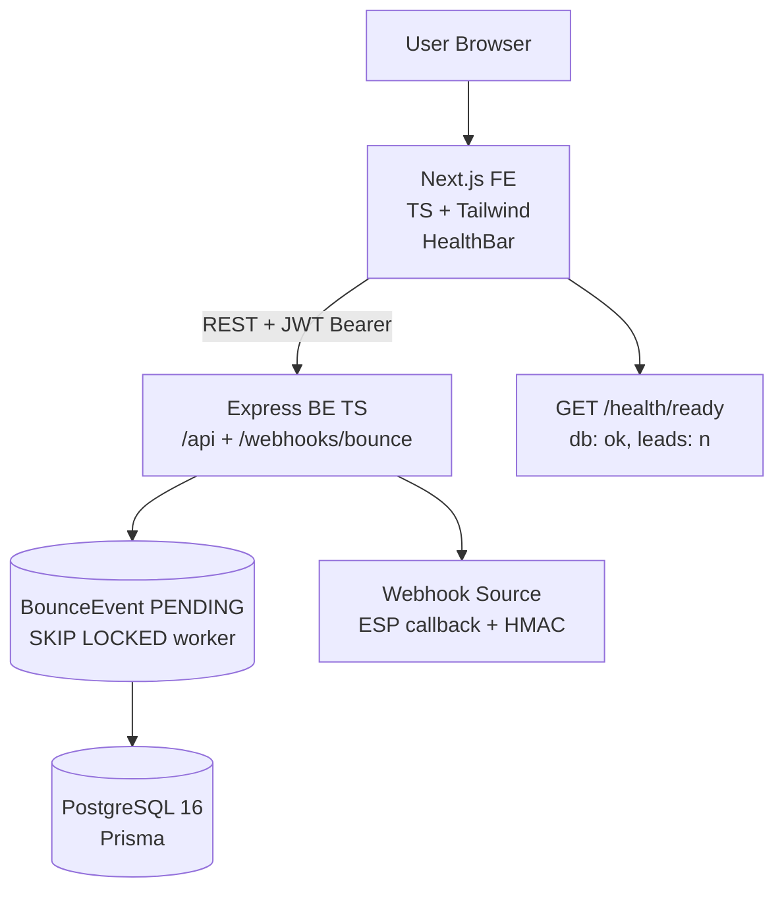

# Dead Letter Office — Architecture

> Stack: **Next.js 16 App Router + React 19 + TypeScript + Tailwind v4 + Node.js + Express 5 + Prisma + PostgreSQL 16 + REST + Docker** — forensic lab theme `ink #0b0b0c / kraft #ece9e4 / accent #c8553d / Courier mono`.

## 1. High-Level



Frontend forwards **live backend only**, no fake fallback. `HealthBar` polls `/health/ready` → pill `LIVE` (green) / `OFFLINE` (red). Bounce path is queued — `SKIP LOCKED` belongs to worker, not webhook.

## 2. Data Model — Prisma / PostgreSQL

```prisma
generator client {
  provider      = "prisma-client-js"
  binaryTargets = ["native", "linux-musl-openssl-3.0.x"] // required for alpine Docker
}

datasource db { provider = "postgresql" url = env("DATABASE_URL") }

model User {
  id String @id @default(uuid())
  email String @unique
  password String
  createdAt DateTime @default(now())
  leads Lead[]
  score HygieneScore?
}

model Lead {
  id String @id @default(uuid())
  email String
  userId String
  status String @default("VALID") // VALID | BOUNCED | RISKY
  softCount Int @default(0)
  reason String? @db.Text // raw SMTP 550 line — exceeds VARCHAR(191)
  createdAt DateTime @default(now())
  user User @relation(fields: [userId], references: [id])
  bounces Bounce[]
  @@unique([userId, email]) // prefix search uses this — never leading %
  @@index([userId, status])
}

model Bounce {
  id String @id @default(uuid())
  leadId String
  eventId String @unique // webhook idempotency — retries can't corrupt score
  type String // hard | soft
  reason String? @db.Text
  createdAt DateTime @default(now())
  lead Lead @relation(fields: [leadId], references: [id])
  @@index([leadId])
}

model BounceEvent { // the queue — this is what SKIP LOCKED belongs to
  id String @id @default(uuid())
  payload String @db.Text
  status String @default("PENDING") // PENDING | PROCESSING | DONE | FAILED
  claimedAt DateTime? // stale claims are requeued — a dead worker can't eat an event
  attempts Int @default(0)
  error String? @db.Text
  createdAt DateTime @default(now())
  @@index([status, createdAt])
}

model HygieneScore {
  id String @id @default(uuid())
  userId String @unique
  total Int @default(0)
  hard Int @default(0)
  soft Int @default(0)
  score Int @default(100)
  user User @relation(fields: [userId], references: [id])
}
```

- DB optimization: `@@unique([userId,email])` prevents a duplicate lead per user *and* gives the worker a keyed
  `findUnique(userId_email)` lookup; `@@index([userId,status])` serves `GET /leads?status=BOUNCED&page&search`.
- Tenant scoping: `Lead.email` is unique **per user**, never globally — every read and every worker lookup must carry
  `userId` or one tenant's bounce lands on another tenant's lead.
- Hygiene calc: pure fn `SOFT_WEIGHT=0.3, RISKY_AFTER_SOFT=3`, `score = 100 - ((hard + 0.3*soft)/total*100)`, applied
  with atomic `increment`s inside the worker transaction so concurrent workers can't clobber the counters.

## 3. API — REST (live only)

| Method | Path | Auth | Description |
|---|---|---|---|
| POST | /api/auth/register {email,password} | no | bcrypt + JWT |
| POST | /api/auth/login | no | → {token} |
| POST | /api/leads/import | JWT | multipart CSV chunk 500, `email.trim().toLowerCase()`, `createMany skipDuplicates` → {imported, skipped}, transaction bumps `HygieneScore.total` |
| GET | /api/leads?status=BOUNCED&page=1&search=gmail | JWT | paginated; `(userId,status)` index bounds the scan, `search` is a substring match within it |
| POST | /api/webhooks/bounce {userId, email, type, reason, eventId} | HMAC `X-Bounce-Signature` over the raw body | enqueues `BounceEvent PENDING` — returns 202 |
| GET | /api/hygiene | JWT | → {total, hard, soft, score} weighted |
| POST | /api/sends/preview {leadIds} | JWT | suppression gate → {sendable, suppressed: [...] } |
| POST | /api/demo/seed | JWT | seeds 20 leads for the caller |
| GET | /api/webhooks-docs | no | curl samples for HMAC |
| GET | /health/live | no | {status: ok} |
| GET | /health/ready | no | {db: ok, leads: n} — 503 if the DB is down |

- **Live only:** `api.ts` `request<T>` throws on `!res.ok` → UI surfaces the error — no `catch(()=>[])` fake data.
- **CORS:** Express `cors({origin: true})` so Vercel preview deploys can reach the API.
- **HMAC verify:** computed over the **raw request bytes** (captured via the `express.json({ verify })` hook), compared
  with `timingSafeEqual` behind a length guard. Re-serializing `req.body` would not reproduce the sender's key order or
  whitespace. Missing `WEBHOOK_SECRET` fails closed with a 500 rather than accepting unverified bounces.

## 4. Frontend — Next App Router

```
/app
  layout.tsx — serif Instrument + sans Inter, HealthBar
  page.tsx — Dashboard (hygiene meter + leads table)
  /import/page.tsx — CSV dropzone
  /leads/page.tsx — forensic table + pagination
  /leads/[id]/page.tsx — autopsy card (reason mono, stamp)
  /dashboard/page.tsx — hygiene score + meter
  /webhooks-docs/page.tsx — curl samples
/components
  HealthBar.tsx — live/offline pill + → {NEXT_PUBLIC_API_BASE}
  AutopsyCard.tsx — lab theme
lib/api.ts — BASE = process.env.NEXT_PUBLIC_API_BASE || 'http://localhost:3001/api' + request<T> + Authorization header
```

- **Forensic lab:** `tw-card` `bg-[#101011] border-white/10`, `BOUNCED` rubber stamp, `Courier` for `550 5.1.1`, `meter` perf timeline — editorial, not AI gradient.
- **Separation:** `/ , /import , /leads , /leads/[id] , /dashboard , /webhooks-docs` — not CineFund `/pledges /watch`.

## 5. Backend — Express TS

```
src/
  index.ts — Express + cors + helmet + morgan + routes
  routes/auth.ts, leads.ts, webhooks.ts, health.ts, demo.ts, sends.ts
  lib/prisma.ts — PrismaClient singleton
  middleware/auth.ts — Bearer JWT
  workers/bounceWorker.ts — loop polling BounceEvent FOR UPDATE SKIP LOCKED
  lib/score.ts — pure computeScore(total, hard, soft)
```

- **CSV import:** `multer` + `csv-parse`, 500-row chunks, `email.trim().toLowerCase()`, `prisma.lead.createMany({skipDuplicates: true})` → bump and recompute `HygieneScore` in one `$transaction`.
- **Bounce worker:** `$transaction` claims with `SELECT id, payload FROM "BounceEvent" WHERE status='PENDING' ORDER BY "createdAt" LIMIT 10 FOR UPDATE SKIP LOCKED`, moving rows to `PROCESSING` with a `claimedAt` stamp. Each event is then applied in its own transaction — `Bounce(eventId @unique)` insert + `Lead.status` + `HygieneScore` increments together — and only marked `DONE` **after** that commits.
  - **Duplicate delivery:** the unique `eventId` aborts the transaction, so the retry changes nothing. Effect is exactly-once.
  - **Crashed worker:** the row is left `PROCESSING`; `requeueStaleClaims()` returns it to `PENDING` after 60s, up to `MAX_ATTEMPTS`, then parks it `FAILED`. Delivery is at-least-once, which the idempotency guard makes safe.
  - **Poison payload:** marked `FAILED` with the error, never retried in a loop.
- **Score fn (testable):**
```ts
export const SOFT_WEIGHT = 0.3, RISKY_AFTER_SOFT = 3
export const computeScore = (total: number, hard: number, soft: number) =>
  total === 0 ? 100 : Math.max(0, Math.round(100 - ((hard + SOFT_WEIGHT * soft) / total) * 100))
```

## 6. Deployment — Free Live

| Layer | Host | Env |
|---|---|---|
| FE | Vercel `vercel --prod` | `NEXT_PUBLIC_API_BASE=https://dead-letter-api.up.railway.app/api` |
| BE | Railway `railway up --service api` | `DATABASE_URL=postgresql://...`, `JWT_SECRET=32b-random`, `WEBHOOK_SECRET`, `PORT=3001` |
| DB | Railway Postgres (or Neon) | `npx prisma db push` |

Docker `node:20-alpine` with `binaryTargets = ["native", "linux-musl-openssl-3.0.x"]` — Prisma needs the musl engine
inside alpine or the client fails to load at runtime.

## 7. Testing & Docs

- **vitest** (`npx vitest run`) over the pure logic: weighted `computeScore` and the `nextLeadStatus` transition table
  (hard quarantines, 3× soft escalates to RISKY, `BOUNCED` is terminal).
- **API reference:** the table in §3 plus `GET /api/webhooks-docs` and the `/webhooks-docs` page, which emit a signed,
  copy-pasteable curl. OpenAPI/Swagger is not wired up yet.

## 8. Links

- Repo: https://github.com/maczeo11/Dead-Letter-Office
